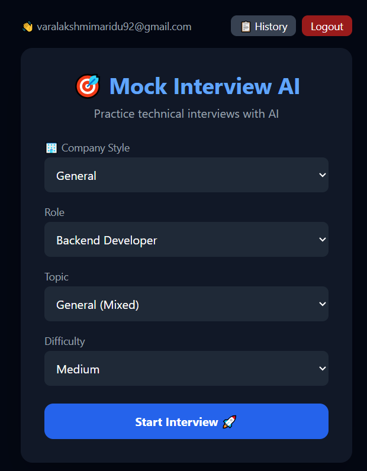

# 🎯 Mock Interview AI

### AI-Powered Technical Interview Simulator for CS Students



## 🔗 Links
- 🌐 Live Demo: https://mock-interview-ai-eight.vercel.app
- 🔧 Backend API: https://mock-interview-ai-hr52.onrender.com
- 📂 GitHub: https://github.com/Varalakshmi2746/mock-interview-ai

---

## 💡 What is This?

Most CS students prepare theory but never practice 
actual interview conversation — they freeze in real interviews.

**Mock Interview AI** simulates a real technical interview with an 
AI interviewer that asks role-specific questions, gives feedback, 
asks follow-up questions, and tracks your progress over time.

---

## ✨ Features

- 🔐 **User Authentication** — Email login/signup with Supabase
- 🤖 **AI Interviewer** — Real conversation flow with follow-up questions
- 🏢 **Company-Specific Mode** — TCS, Infosys, Wipro, Accenture, Product Company styles
- 📚 **Topic-Wise Practice** — DBMS, OOPs, OS, Networks, DSA, System Design
- 🎯 **Role-Based Questions** — Backend, Frontend, Full Stack, DSA
- ⏱️ **Question Timer** — 2 minutes per question with auto-submit
- 💡 **Hint System** — 2 hints available per question
- 📊 **Interview History** — Track past interviews with progress stats
- 📈 **Performance Analytics** — Total, Average, Best score tracking
- 📸 **Score Card Export** — Download shareable score card image
- 🛑 **End Interview** — Stop anytime and return home
- 🌙 **Dark UI** — Clean, modern interface

---

## 🛠️ Tech Stack

**Frontend:**


**Backend:**


**Database & Auth:**


**AI:**


**Deployment:**


---

## 📁 Project Structure

```
mock-interview-ai/
├── backend/
│   ├── main.py          # FastAPI server with AI logic
│   ├── requirements.txt
│   └── .env             # API keys (not in repo)
├── frontend/
│   ├── src/
│   │   ├── App.js       # Main React component
│   │   ├── supabase.js  # Supabase client config
│   │   └── index.css    # Tailwind styles
│   └── package.json
└── README.md
```

---

## 🚀 Run Locally

### Prerequisites
- Python 3.11+
- Node.js 18+
- OpenRouter API Key (free at openrouter.ai)
- Supabase Project (free at supabase.com)

### Backend Setup
```bash
cd backend
pip install -r requirements.txt
```

Create `.env` file:
```
OPENROUTER_API_KEY=your-key-here
```

Run backend:
```bash
uvicorn main:app --reload
```

### Frontend Setup
```bash
cd frontend
npm install
```

Update `src/supabase.js` with your Supabase URL and anon key.

```bash
npm start
```

Open: `http://localhost:3000`

---

## 🎮 How to Use

```
1. Sign up / Login with email
2. Select Company Style (TCS, Infosys, etc.)
3. Select Role (Backend, Frontend, Full Stack, DSA)
4. Select Topic (DBMS, OOPs, OS, Networks, etc.)
5. Select Difficulty (Easy, Medium, Hard)
6. Click "Start Interview"
7. Answer questions within 2-minute timer
8. Use hints if stuck (2 available)
9. End anytime or complete 5 questions
10. View score, feedback, and download score card
11. Track progress in History panel
```

---

## 🤔 Why This Project?

Existing tools like InterviewBit give static question banks 
with no conversation flow. This project simulates a **real interview** where:

- AI asks contextual follow-up questions
- Evaluates actual explanation quality
- Adapts to company-specific interview styles
- Tracks improvement over multiple sessions

---

## 👩‍💻 Developer

**M Varalakshmi**
- GitHub: [@Varalakshmi2746](https://github.com/Varalakshmi2746)
- 3rd Year CSE Student

---

## 📄 License

MIT License — feel free to use and modify!